# Project Context

> **Auto-generated by [code-mapper](https://github.com/your-org/code-mapper).**  
> Read this file instead of scanning source files — it captures the full structure at a fraction of the token cost.
> `UE5-EmploymentProj` · 107 files (cpp×102, csharp×5) · 66 classes · 15 functions · ~9,216 source lines

---
## File Structure

```
UE5-EmploymentProj/
├── EmploymentProj/
  ├── Plugins/
    ├── GameplayMessageRouter/
      ├── Source/
        ├── GameplayMessageNodes/
          └── GameplayMessageNodes.Build.cs
          ├── Private/
            └── GameplayMessageNodesModule.cpp
            └── K2Node_AsyncAction_ListenForGameplayMessages.cpp
          ├── Public/
            └── K2Node_AsyncAction_ListenForGameplayMessages.h
        ├── GameplayMessageRuntime/
          └── GameplayMessageRuntime.Build.cs
          ├── Private/
            ├── GameFramework/
              └── AsyncAction_ListenForGameplayMessage.cpp
              └── GameplayMessageRuntime.cpp
              └── GameplayMessageSubsystem.cpp
          ├── Public/
            ├── GameFramework/
              └── AsyncAction_ListenForGameplayMessage.h
              └── GameplayMessageSubsystem.h
              └── GameplayMessageTypes2.h
  ├── Source/
    └── EmploymentProj.Target.cs
    └── EmploymentProjEditor.Target.cs
    ├── EmploymentProj/
      └── EmploymentProj.Build.cs
      └── EmploymentProj.cpp
      └── EmploymentProj.h
      ├── Private/
        ├── Animation/
          └── EPAnimInstance.cpp
          └── EPWeaponAnimInstance.cpp
        ├── Combat/
          └── EPCombatComponent.cpp
          └── EPCombatDeveloperSettings.cpp
          └── EPPhysicalMaterial.cpp
          └── EPProjectile.cpp
          └── EPServerSideRewindComponent.cpp
          └── EPWeapon.cpp
        ├── Core/
          └── EPCharacter.cpp
          └── EPCorpse.cpp
          └── EPGameInstance.cpp
          └── EPGameMode.cpp
          └── EPGameState.cpp
          └── EPPlayerController.cpp
          └── EPPlayerState.cpp
        ├── Data/
          └── EPItemDefinition.cpp
          └── EPItemDefinitionSubsystem.cpp
          └── EPLootDeveloperSettings.cpp
          └── EPWeaponDefinition.cpp
        ├── GAS/
          └── EPAttributeSet.cpp
          └── EPGA_Death.cpp
          └── EPGA_Interact.cpp
          └── EPGA_Item_PrimaryUse.cpp
          └── EPGA_Item_Reload.cpp
          └── EPGA_Skill_Base.cpp
          └── EPGA_Skill_Dash.cpp
          └── EPGA_Skill_Heal.cpp
          └── EPGA_Skill_ShieldOn.cpp
          └── EPNativeGameplayTags.cpp
        ├── HUD/
          └── EPBarGaugeWidget.cpp
          └── EPCastGaugeWidget.cpp
          └── EPCrosshairWidget.cpp
          └── EPHUDWidget.cpp
          └── EPMaterialGaugeWidget.cpp
          └── EPSkillSlotWidget.cpp
        ├── Interaction/
          └── EPInteractionComponent.cpp
        ├── Inventory/
          └── EPInventoryCheats.cpp
          └── EPInventoryComponent.cpp
        ├── Loot/
          └── EPItemSpawner.cpp
          └── EPLootDebugCommands.cpp
          └── EPLootTable.cpp
          └── EPPickup.cpp
        ├── Movement/
          └── EPCharacterMovement.cpp
      ├── Public/
        ├── Animation/
          └── EPAnimInstance.h
          └── EPWeaponAnimInstance.h
        ├── Combat/
          └── EPCombatComponent.h
          └── EPCombatDeveloperSettings.h
          └── EPPhysicalMaterial.h
          └── EPProjectile.h
          └── EPServerSideRewindComponent.h
          └── EPWeapon.h
        ├── Core/
          └── EPCharacter.h
          └── EPCorpse.h
          └── EPGameInstance.h
          └── EPGameMode.h
          └── EPGameState.h
          └── EPPlayerController.h
          └── EPPlayerState.h
        ├── Data/
          └── EPItemData.h
          └── EPItemDefinition.h
          └── EPItemDefinitionSubsystem.h
          └── EPLootDeveloperSettings.h
          └── EPWeaponDefinition.h
        ├── GAS/
          └── EPAttributeSet.h
          └── EPDurationMessage.h
          └── EPGA_Death.h
          └── EPGA_Interact.h
          └── EPGA_Item_PrimaryUse.h
          └── EPGA_Item_Reload.h
          └── EPGA_Skill_Base.h
          └── EPGA_Skill_Dash.h
          └── EPGA_Skill_Heal.h
          └── EPGA_Skill_ShieldOn.h
          └── EPNativeGameplayTags.h
        ├── HUD/
          └── EPBarGaugeWidget.h
          └── EPCastGaugeWidget.h
          └── EPCrosshairWidget.h
          └── EPGaugeVisual.h
          └── EPHUDWidget.h
          └── EPMaterialGaugeWidget.h
          └── EPSkillSlotWidget.h
        ├── Interaction/
          └── EPInteractable.h
          └── EPInteractionComponent.h
        ├── Inventory/
          └── EPInventoryCheats.h
          └── EPInventoryComponent.h
          └── EPInventoryTypes.h
        ├── Loot/
          └── EPItemSpawner.h
          └── EPLootTable.h
          └── EPPickup.h
        ├── Movement/
          └── EPCharacterMovement.h
        ├── Types/
          └── EPTypes.h
```

## Class Diagram

```mermaid
classDiagram
    direction LR
    class AEPCharacter["AEPCharacter"] {
        +FirstPersonCamera
        +CombatComponent
        +RewindComponent
        +InteractionComponent
        +GetAbilitySystemComponent()
        +GetIsSprinting()
        +GetIsAiming()
        +GetCameraComponent()
        +GetCombatComponent()
        +GetInteractionComponent()
        +GetInventoryComponent()
        ...
    }
    class AEPCorpse["AEPCorpse"] {
        +CorpseMesh
        +FaceMesh
        +OutfitMesh
        +CorpseMeshAsset
        +InitializeFromCharacter()
        +Interact()
        +OnRep_CorpseMeshAsset()
        +OnRep_CorpseFaceAsset()
        +OnRep_CorpseOutfitAsset()
        +ApplyCorpseMesh()
        +GetLifetimeReplicatedProps()
    }
    class AEPGameMode["AEPGameMode"] {
        +MatchDuration
        +MinPlayersToStart
        +AlivePlayerCount
        +EPGameState
        +AddKillToPlayer()
        +OnPlayerKilled()
        +BeginPlay()
        +PostLogin()
        +Logout()
        +ChoosePlayerStart_Implementation()
        +HandleMatchHasStarted()
        ...
    }
    class AEPGameState["AEPGameState"] {
        +RemainingTime
        +MatchPhase
        +OnRep_RemainingTime()
        +OnRep_MatchPhase()
        +SetRemainingTime()
        +SetMatchPhase()
        +GetLifetimeReplicatedProps()
    }
    class AEPItemSpawner["AEPItemSpawner"] {
        +LootTable
        +RollCount
        +SpawnRadius
        +bAlignToGround
        +SpawnLoot()
        +ClearLoot()
    }
    class AEPPickup["AEPPickup"] {
        +ItemId
        +State
        +Mesh
        +InitPickup()
        +GetInteractText()
        +CanInteract()
        +OnInteract()
        +GetLifetimeReplicatedProps()
        +OnRep_ItemId()
        +ApplyVisual()
    }
    class AEPPlayerController["AEPPlayerController"] {
        +DefaultMappingContext
        +MoveAction
        +LookAction
        +JumpAction
        +InitHUD()
        +SetInteractPrompt()
        +Client_OnKill()
        +Client_OnInteractFailed()
        +Client_PlayHitConfirmSound()
        +BeginPlay()
        +AddCheats()
        ...
    }
    class AEPPlayerState["AEPPlayerState"] {
        +KillCount
        +bIsExtracted
        +HealthChangedDelegateHandle
        +GetAbilitySystemComponent()
        +AddKill()
        +SetExtracted()
        +BeginPlay()
        +EndPlay()
        +HealthChanged()
        +OnRep_KillCount()
        ...
    }
    class AEPProjectile["AEPProjectile"] {
        +CollisionComp
        +MovementComp
        +Initialize()
        +SetCosmeticOnly()
    }
    class AEPWeapon["AEPWeapon"] {
        +WeaponDef
        +WeaponMesh
        +CurrentSpread
        +ConsecutiveShots
        +BP_PlayImpactEffect()
        +CanFire()
        +Fire()
        +ApplySpread()
        +GetDamage()
        +UpdateSpread()
        +CalculateSpread()
        ...
    }
    class EEPBallisticType["EEPBallisticType"] {
    }
    class EEPFireMode["EEPFireMode"] {
    }
    class EEPItemRarity["EEPItemRarity"] {
    }
    class EEPItemType["EEPItemType"] {
    }
    class EEPMatchPhase["EEPMatchPhase"] {
    }
    class EEPSkillSlotState["EEPSkillSlotState"] {
    }
    class EEPWeaponState["EEPWeaponState"] {
    }
    class EGameplayMessageMatch["EGameplayMessageMatch"] {
    }
    class EmploymentProj["EmploymentProj"] {
    }
    class EmploymentProjEditorTarget["EmploymentProjEditorTarget"] {
    }
    class EmploymentProjTarget["EmploymentProjTarget"] {
    }
    class FNetworkPredictionData_Client["FNetworkPredictionData_Client"] {
    }
    class FNetworkPredictionData_Client_EPCharacter["FNetworkPredictionData_Client_EPCharacter"] {
    }
    class FSavedMove_EPCharacter["FSavedMove_EPCharacter"] {
        +Clear()
        +GetCompressedFlags()
        +CanCombineWith()
        +PrepMoveFor()
    }
    class GameplayMessageNodes["GameplayMessageNodes"] {
    }
    class GameplayMessageRuntime["GameplayMessageRuntime"] {
    }
    class IEPGaugeVisual["IEPGaugeVisual"] {
        +SetGaugeProgress()
        +SetGaugeVisible()
    }
    class IEPInteractable["IEPInteractable"] {
    }
    class UAsyncAction_ListenForGameplayMessage["UAsyncAction_ListenForGameplayMessage"] {
        +OnMessageReceived
    }
    class UEPAnimInstance["UEPAnimInstance"] {
        +Speed
        +Direction
        +bIsSprinting
        +bIsFalling
        +NativeInitializeAnimation()
        +NativeUpdateAnimation()
    }
    class UEPAttributeSet["UEPAttributeSet"] {
        +Health
        +MaxHealth
        +IncomingDamage
        +Ammo
        +PreAttributeChange()
        +PostGameplayEffectExecute()
        +GetLifetimeReplicatedProps()
        +OnRep_Health()
        +OnRep_MaxHealth()
        +OnRep_Ammo()
        +OnRep_MaxAmmo()
        ...
    }
    class UEPBarGaugeWidget["UEPBarGaugeWidget"] {
        +GaugeBar
        +bInvertProgress
        +SetGaugeProgress_Implementation()
        +SetGaugeVisible_Implementation()
    }
    class UEPCastGaugeWidget["UEPCastGaugeWidget"] {
        +CastChannelTag
        +GaugeVisual
        +InitWithASC()
        +NativeConstruct()
        +NativeTick()
        +NativeDestruct()
    }
    class UEPCharacterMovement["UEPCharacterMovement"] {
        +SprintSpeed
        +AimSpeed
        +OnServerMoveProcessed
        +GetMaxSpeed()
        +UpdateFromCompressedFlags()
        +OnMovementUpdated()
        +CanCrouchInCurrentState()
    }
    class UEPCombatComponent["UEPCombatComponent"] {
        +GE_DamageClass
        +EquippedWeapon
        +MuzzleFX
        +ImpactFX
        +EquipWeapon()
        +UnequipWeapon()
        +GetOwnerCharacter()
        +GetEquippedWeapon()
        +HandleServerFire()
        +Server_ConfirmFire()
        +PlayLocalMuzzleEffect()
        ...
    }
    class UEPCombatDeveloperSettings["UEPCombatDeveloperSettings"] {
        +MaxRewindSeconds
        +PredictionFudgeSeconds
        +BroadPhasePaddingCm
        +DefaultTraceDistanceCm
    }
    class UEPCrosshairWidget["UEPCrosshairWidget"] {
        +CrosshairSpread
    }
    class UEPGA_Death["UEPGA_Death"] {
        +GE_StateDeadClass
    }
    class UEPGA_Interact["UEPGA_Interact"] {
    }
    class UEPGA_Item_PrimaryUse["UEPGA_Item_PrimaryUse"] {
        +ServerConfirmOneShot()
    }
    class UEPGA_Item_Reload["UEPGA_Item_Reload"] {
        +GE_ReloadingClass
        +GE_ReloadAmmoClass
    }
    class UEPGA_Skill_Base["UEPGA_Skill_Base"] {
        +CastTime
        +bInterruptibleOnDamage
        +GE_CastingClass
        +Cooldown
        +SetCooldownTag()
        +ApplyCooldownGE()
        +BroadcastActiveDuration()
    }
    class UEPGA_Skill_Dash["UEPGA_Skill_Dash"] {
        +DashImpulse
        +DashZBoost
        +OnCastComplete()
    }
    UEPGA_Skill_Base <|-- UEPGA_Skill_Dash : extends
    class UEPGA_Skill_Heal["UEPGA_Skill_Heal"] {
        +GE_HealClass
        +HealAmount
        +HealMoveSpeedMultiplier
        +OnCastComplete()
        +ConfigureCastingSpec()
    }
    UEPGA_Skill_Base <|-- UEPGA_Skill_Heal : extends
    class UEPGA_Skill_ShieldOn["UEPGA_Skill_ShieldOn"] {
        +GE_ShieldOnClass
        +ShieldDuration
        +OnCastComplete()
    }
    UEPGA_Skill_Base <|-- UEPGA_Skill_ShieldOn : extends
    class UEPGameInstance["UEPGameInstance"] {
        +Init()
    }
    class UEPGaugeVisual["UEPGaugeVisual"] {
    }
    class UEPHUDWidget["UEPHUDWidget"] {
        +HealthBar
        +HealthText
        +AmmoText
        +ReloadingText
        +InitWithASC()
        +SetInteractPrompt()
        +NativeTick()
        +NativeDestruct()
    }
    class UEPInteractable["UEPInteractable"] {
    }
    class UEPInteractionComponent["UEPInteractionComponent"] {
        +InteractRange
        +ServerRangeTolerance
        +Input_Interact()
        +RefreshTickEnabled()
        +TickComponent()
    }
    class UEPInventoryCheats["UEPInventoryCheats"] {
        +EPInvAdd()
        +EPInvDrop()
        +EPInvReorder()
        +EPInvMove()
    }
    class UEPInventoryComponent["UEPInventoryComponent"] {
        +OnInventoryChanged
        +AddItem()
        +AddSubtree()
        +FindEntry()
        +FindFungibleEntryId()
        +GetUsedSlots()
        +GetCapacity()
        +CanFit()
        ...
    }
    class UEPItemDefinition["UEPItemDefinition"] {
        +ItemId
        +ItemDataRow
        +WorldMesh
        +Icon
        +InitState()
        +GetPrimaryAssetId()
        +IsDataValid()
    }
    class UEPItemDefinitionSubsystem["UEPItemDefinitionSubsystem"] {
        +Initialize()
        +Deinitialize()
        +Get()
        +FindData()
        +FindDefinition()
        +MakeItemState()
    }
    class UEPLootDeveloperSettings["UEPLootDeveloperSettings"] {
        +ItemDataTable
        +bEnableLootDebugLog
        +bEnableSpawnerDebugDraw
        +PlaceholderPickupMesh
    }
    class UEPLootTable["UEPLootTable"] {
        +Entries
        +EmptyWeight
        +IsDataValid()
    }
    class UEPMaterialGaugeWidget["UEPMaterialGaugeWidget"] {
        +GaugeImage
        +ProgressParamName
        +bInvertProgress
        +SetGaugeProgress_Implementation()
        +SetGaugeVisible_Implementation()
        +NativeConstruct()
    }
    class UEPPhysicalMaterial["UEPPhysicalMaterial"] {
        +MaterialTags
    }
    class UEPServerSideRewindComponent["UEPServerSideRewindComponent"] {
        +HitBones
        +MaxHistoryCount
        +HitboxHistory
        +bHasPendingSnapshot
        +TickComponent()
        +GetSnapshotAtTime()
        +BeginPlay()
        +SaveHitboxSnapshot()
        +OnServerMoveProcessed()
    }
    class UEPSkillSlotWidget["UEPSkillSlotWidget"] {
        +CooldownChannelTag
        +ActiveChannelTag
        +LockTags
        +SlotBorder
        +InitWithASC()
        +NativeTick()
        +NativeDestruct()
    }
    class UEPWeaponAnimInstance["UEPWeaponAnimInstance"] {
        +CachedMainAnimBP
        +NativeInitializeAnimation()
    }
    class UEPWeaponDefinition["UEPWeaponDefinition"] {
        +WeaponAbilities
        +WeaponName
        +FireMode
        +Damage
        +InitState()
    }
    UEPItemDefinition <|-- UEPWeaponDefinition : extends
    class UGameplayMessageSubsystem["UGameplayMessageSubsystem"] {
        +WeakObject()
    }
    class UInputComponent["UInputComponent"] {
    }
    class UK2Node_AsyncAction_ListenForGameplayMessages["UK2Node_AsyncAction_ListenForGameplayMessages"] {
    }
```



## Module Dependencies

_No internal dependencies detected._

## Symbol Index


**`EmploymentProj\Plugins\GameplayMessageRouter\Source\GameplayMessageNodes\GameplayMessageNodes.Build.cs`** `csharp`
- `class GameplayMessageNodes(ModuleRules)`

**`EmploymentProj\Plugins\GameplayMessageRouter\Source\GameplayMessageNodes\Public\K2Node_AsyncAction_ListenForGameplayMessages.h`** `cpp`
- `class UK2Node_AsyncAction_ListenForGameplayMessages(UK2Node_AsyncAction)`

**`EmploymentProj\Plugins\GameplayMessageRouter\Source\GameplayMessageRuntime\GameplayMessageRuntime.Build.cs`** `csharp`
- `class GameplayMessageRuntime(ModuleRules)`

**`EmploymentProj\Plugins\GameplayMessageRouter\Source\GameplayMessageRuntime\Private\GameFramework\AsyncAction_ListenForGameplayMessage.cpp`** `cpp`
- `WeakThis()`

**`EmploymentProj\Plugins\GameplayMessageRouter\Source\GameplayMessageRuntime\Private\GameFramework\GameplayMessageSubsystem.cpp`** `cpp`
- `ListenerArray()`

**`EmploymentProj\Plugins\GameplayMessageRouter\Source\GameplayMessageRuntime\Public\GameFramework\AsyncAction_ListenForGameplayMessage.h`** `cpp`
- `class UAsyncAction_ListenForGameplayMessage(UCancellableAsyncAction)`

**`EmploymentProj\Plugins\GameplayMessageRouter\Source\GameplayMessageRuntime\Public\GameFramework\GameplayMessageSubsystem.h`** `cpp`
- `class UGameplayMessageSubsystem(UGameInstanceSubsystem)`
  methods: `WeakObject`
- `DECLARE_LOG_CATEGORY_EXTERN()`

**`EmploymentProj\Plugins\GameplayMessageRouter\Source\GameplayMessageRuntime\Public\GameFramework\GameplayMessageTypes2.h`** `cpp`
- `class EGameplayMessageMatch`
- `WeakObject()`

**`EmploymentProj\Source\EmploymentProj.Target.cs`** `csharp`
- `class EmploymentProjTarget(TargetRules)`

**`EmploymentProj\Source\EmploymentProjEditor.Target.cs`** `csharp`
- `class EmploymentProjEditorTarget(TargetRules)`

**`EmploymentProj\Source\EmploymentProj\EmploymentProj.Build.cs`** `csharp`
- `class EmploymentProj(ModuleRules)`

**`EmploymentProj\Source\EmploymentProj\Private\Combat\EPCombatComponent.cpp`** `cpp`
- `Spec()`

**`EmploymentProj\Source\EmploymentProj\Private\Core\EPCharacter.cpp`** `cpp`
- `UseTags()`

**`EmploymentProj\Source\EmploymentProj\Private\Data\EPItemDefinitionSubsystem.cpp`** `cpp`
- `ItemId()`

**`EmploymentProj\Source\EmploymentProj\Private\Inventory\EPInventoryComponent.cpp`** `cpp`
- `Guard()`
- `Guard()`
- `Guard()`
- `Guard()`
- `Guard()`
- `Guard()`

**`EmploymentProj\Source\EmploymentProj\Private\Movement\EPCharacterMovement.cpp`** `cpp`
- `class FSavedMove_EPCharacter(FSavedMove_Character)`
  methods: `Clear`, `GetCompressedFlags`, `CanCombineWith`, `PrepMoveFor`
- `class FNetworkPredictionData_Client_EPCharacter(FNetworkPredictionData_Client_Character)`
- `class FNetworkPredictionData_Client`

**`EmploymentProj\Source\EmploymentProj\Public\Animation\EPAnimInstance.h`** `cpp`
- `class UEPAnimInstance(UAnimInstance)`
  methods: `NativeInitializeAnimation`, `NativeUpdateAnimation`

**`EmploymentProj\Source\EmploymentProj\Public\Animation\EPWeaponAnimInstance.h`** `cpp`
- `class UEPWeaponAnimInstance(UAnimInstance)`
  methods: `NativeInitializeAnimation`

**`EmploymentProj\Source\EmploymentProj\Public\Combat\EPCombatComponent.h`** `cpp`
- `class UEPCombatComponent(UActorComponent)`
  methods: `EquipWeapon`, `UnequipWeapon`, `GetOwnerCharacter`, `GetEquippedWeapon`, `HandleServerFire`, `Server_ConfirmFire`, `PlayLocalMuzzleEffect`, `PlayLocalImpactEffect`, +7 more

**`EmploymentProj\Source\EmploymentProj\Public\Combat\EPCombatDeveloperSettings.h`** `cpp`
- `class UEPCombatDeveloperSettings(UDeveloperSettings)`

**`EmploymentProj\Source\EmploymentProj\Public\Combat\EPPhysicalMaterial.h`** `cpp`
- `class UEPPhysicalMaterial(UPhysicalMaterial)`

**`EmploymentProj\Source\EmploymentProj\Public\Combat\EPProjectile.h`** `cpp`
- `class AEPProjectile(AActor)`
  methods: `Initialize`, `SetCosmeticOnly`

**`EmploymentProj\Source\EmploymentProj\Public\Combat\EPServerSideRewindComponent.h`** `cpp`
- `class UEPServerSideRewindComponent(UActorComponent)`
  methods: `TickComponent`, `GetSnapshotAtTime`, `BeginPlay`, `SaveHitboxSnapshot`, `OnServerMoveProcessed`

**`EmploymentProj\Source\EmploymentProj\Public\Combat\EPWeapon.h`** `cpp`
- `class AEPWeapon(AActor)`
  methods: `BP_PlayImpactEffect`, `CanFire`, `Fire`, `ApplySpread`, `GetDamage`, `UpdateSpread`, `CalculateSpread`, `BeginPlay`, +2 more

**`EmploymentProj\Source\EmploymentProj\Public\Core\EPCharacter.h`** `cpp`
- `class AEPCharacter(ACharacter)`
  methods: `GetAbilitySystemComponent`, `GetIsSprinting`, `GetIsAiming`, `GetCameraComponent`, `GetCombatComponent`, `GetInteractionComponent`, `GetInventoryComponent`, `IsDead`, +28 more
- `class UInputComponent`

**`EmploymentProj\Source\EmploymentProj\Public\Core\EPCorpse.h`** `cpp`
- `class AEPCorpse(AActor)`
  methods: `InitializeFromCharacter`, `Interact`, `OnRep_CorpseMeshAsset`, `OnRep_CorpseFaceAsset`, `OnRep_CorpseOutfitAsset`, `ApplyCorpseMesh`, `GetLifetimeReplicatedProps`

**`EmploymentProj\Source\EmploymentProj\Public\Core\EPGameInstance.h`** `cpp`
- `class UEPGameInstance(UGameInstance)`
  methods: `Init`

**`EmploymentProj\Source\EmploymentProj\Public\Core\EPGameMode.h`** `cpp`
- `class AEPGameMode(AGameMode)`
  methods: `AddKillToPlayer`, `OnPlayerKilled`, `BeginPlay`, `PostLogin`, `Logout`, `ChoosePlayerStart_Implementation`, `HandleMatchHasStarted`, `HandleMatchHasEnded`, +6 more

**`EmploymentProj\Source\EmploymentProj\Public\Core\EPGameState.h`** `cpp`
- `class AEPGameState(AGameState)`
  methods: `OnRep_RemainingTime`, `OnRep_MatchPhase`, `SetRemainingTime`, `SetMatchPhase`, `GetLifetimeReplicatedProps`

**`EmploymentProj\Source\EmploymentProj\Public\Core\EPPlayerController.h`** `cpp`
- `class AEPPlayerController(APlayerController)`
  methods: `InitHUD`, `SetInteractPrompt`, `Client_OnKill`, `Client_OnInteractFailed`, `Client_PlayHitConfirmSound`, `BeginPlay`, `AddCheats`, `OnPossess`

**`EmploymentProj\Source\EmploymentProj\Public\Core\EPPlayerState.h`** `cpp`
- `class AEPPlayerState(APlayerState)`
  methods: `GetAbilitySystemComponent`, `AddKill`, `SetExtracted`, `BeginPlay`, `EndPlay`, `HealthChanged`, `OnRep_KillCount`, `OnRep_IsExtracted`, +1 more

**`EmploymentProj\Source\EmploymentProj\Public\Data\EPItemDefinition.h`** `cpp`
- `class UEPItemDefinition(UPrimaryDataAsset)`
  methods: `InitState`, `GetPrimaryAssetId`, `IsDataValid`

**`EmploymentProj\Source\EmploymentProj\Public\Data\EPItemDefinitionSubsystem.h`** `cpp`
- `class UEPItemDefinitionSubsystem(UGameInstanceSubsystem)`
  methods: `Initialize`, `Deinitialize`, `Get`, `FindData`, `FindDefinition`, `MakeItemState`

**`EmploymentProj\Source\EmploymentProj\Public\Data\EPLootDeveloperSettings.h`** `cpp`
- `class UEPLootDeveloperSettings(UDeveloperSettings)`

**`EmploymentProj\Source\EmploymentProj\Public\Data\EPWeaponDefinition.h`** `cpp`
- `class UEPWeaponDefinition(UEPItemDefinition)`
  methods: `InitState`

**`EmploymentProj\Source\EmploymentProj\Public\GAS\EPAttributeSet.h`** `cpp`
- `class UEPAttributeSet(UAttributeSet)`
  methods: `PreAttributeChange`, `PostGameplayEffectExecute`, `GetLifetimeReplicatedProps`, `OnRep_Health`, `OnRep_MaxHealth`, `OnRep_Ammo`, `OnRep_MaxAmmo`, `OnRep_MoveSpeedMultiplier`

**`EmploymentProj\Source\EmploymentProj\Public\GAS\EPGA_Death.h`** `cpp`
- `class UEPGA_Death(UGameplayAbility)`

**`EmploymentProj\Source\EmploymentProj\Public\GAS\EPGA_Interact.h`** `cpp`
- `class UEPGA_Interact(UGameplayAbility)`

**`EmploymentProj\Source\EmploymentProj\Public\GAS\EPGA_Item_PrimaryUse.h`** `cpp`
- `class UEPGA_Item_PrimaryUse(UGameplayAbility)`
  methods: `ServerConfirmOneShot`

**`EmploymentProj\Source\EmploymentProj\Public\GAS\EPGA_Item_Reload.h`** `cpp`
- `class UEPGA_Item_Reload(UGameplayAbility)`

**`EmploymentProj\Source\EmploymentProj\Public\GAS\EPGA_Skill_Base.h`** `cpp`
- `class UEPGA_Skill_Base(UGameplayAbility)`
  methods: `SetCooldownTag`, `ApplyCooldownGE`, `BroadcastActiveDuration`

**`EmploymentProj\Source\EmploymentProj\Public\GAS\EPGA_Skill_Dash.h`** `cpp`
- `class UEPGA_Skill_Dash(UEPGA_Skill_Base)`
  methods: `OnCastComplete`

**`EmploymentProj\Source\EmploymentProj\Public\GAS\EPGA_Skill_Heal.h`** `cpp`
- `class UEPGA_Skill_Heal(UEPGA_Skill_Base)`
  methods: `OnCastComplete`, `ConfigureCastingSpec`

**`EmploymentProj\Source\EmploymentProj\Public\GAS\EPGA_Skill_ShieldOn.h`** `cpp`
- `class UEPGA_Skill_ShieldOn(UEPGA_Skill_Base)`
  methods: `OnCastComplete`

**`EmploymentProj\Source\EmploymentProj\Public\HUD\EPBarGaugeWidget.h`** `cpp`
- `class UEPBarGaugeWidget(UUserWidget)`
  methods: `SetGaugeProgress_Implementation`, `SetGaugeVisible_Implementation`

**`EmploymentProj\Source\EmploymentProj\Public\HUD\EPCastGaugeWidget.h`** `cpp`
- `class UEPCastGaugeWidget(UUserWidget)`
  methods: `InitWithASC`, `NativeConstruct`, `NativeTick`, `NativeDestruct`

**`EmploymentProj\Source\EmploymentProj\Public\HUD\EPCrosshairWidget.h`** `cpp`
- `class UEPCrosshairWidget(UUserWidget)`

**`EmploymentProj\Source\EmploymentProj\Public\HUD\EPGaugeVisual.h`** `cpp`
- `class UEPGaugeVisual(UInterface)`
- `class IEPGaugeVisual`
  methods: `SetGaugeProgress`, `SetGaugeVisible`

**`EmploymentProj\Source\EmploymentProj\Public\HUD\EPHUDWidget.h`** `cpp`
- `class UEPHUDWidget(UUserWidget)`
  methods: `InitWithASC`, `SetInteractPrompt`, `NativeTick`, `NativeDestruct`

**`EmploymentProj\Source\EmploymentProj\Public\HUD\EPMaterialGaugeWidget.h`** `cpp`
- `class UEPMaterialGaugeWidget(UUserWidget)`
  methods: `SetGaugeProgress_Implementation`, `SetGaugeVisible_Implementation`, `NativeConstruct`

**`EmploymentProj\Source\EmploymentProj\Public\HUD\EPSkillSlotWidget.h`** `cpp`
- `class EEPSkillSlotState`
- `class UEPSkillSlotWidget(UUserWidget)`
  methods: `InitWithASC`, `NativeTick`, `NativeDestruct`

**`EmploymentProj\Source\EmploymentProj\Public\Interaction\EPInteractable.h`** `cpp`
- `class UEPInteractable(UInterface)`
- `class IEPInteractable`

**`EmploymentProj\Source\EmploymentProj\Public\Interaction\EPInteractionComponent.h`** `cpp`
- `class UEPInteractionComponent(UActorComponent)`
  methods: `Input_Interact`, `RefreshTickEnabled`, `TickComponent`

**`EmploymentProj\Source\EmploymentProj\Public\Inventory\EPInventoryCheats.h`** `cpp`
- `class UEPInventoryCheats(UCheatManagerExtension)`
  methods: `EPInvAdd`, `EPInvDrop`, `EPInvReorder`, `EPInvMove`

**`EmploymentProj\Source\EmploymentProj\Public\Inventory\EPInventoryComponent.h`** `cpp`
- `class UEPInventoryComponent(UActorComponent)`
  methods: `AddItem`, `AddSubtree`, `FindEntry`, `FindFungibleEntryId`, `GetUsedSlots`, `GetCapacity`, `CanFit`, `IsFungible`, +14 more
- `NetDeltaSerialize()`
- `PostReplicatedReceive()`

**`EmploymentProj\Source\EmploymentProj\Public\Loot\EPItemSpawner.h`** `cpp`
- `class AEPItemSpawner(AActor)`
  methods: `SpawnLoot`, `ClearLoot`

**`EmploymentProj\Source\EmploymentProj\Public\Loot\EPLootTable.h`** `cpp`
- `class UEPLootTable(UPrimaryDataAsset)`
  methods: `IsDataValid`

**`EmploymentProj\Source\EmploymentProj\Public\Loot\EPPickup.h`** `cpp`
- `class AEPPickup(AActor)`
  methods: `InitPickup`, `GetInteractText`, `CanInteract`, `OnInteract`, `GetLifetimeReplicatedProps`, `OnRep_ItemId`, `ApplyVisual`

**`EmploymentProj\Source\EmploymentProj\Public\Movement\EPCharacterMovement.h`** `cpp`
- `class UEPCharacterMovement(UCharacterMovementComponent)`
  methods: `GetMaxSpeed`, `UpdateFromCompressedFlags`, `OnMovementUpdated`, `CanCrouchInCurrentState`
- `class FNetworkPredictionData_Client`

**`EmploymentProj\Source\EmploymentProj\Public\Types\EPTypes.h`** `cpp`
- `class EEPMatchPhase`
- `class EEPItemRarity`
- `class EEPFireMode`
- `class EEPWeaponState`
- `class EEPItemType`
- `class EEPBallisticType`