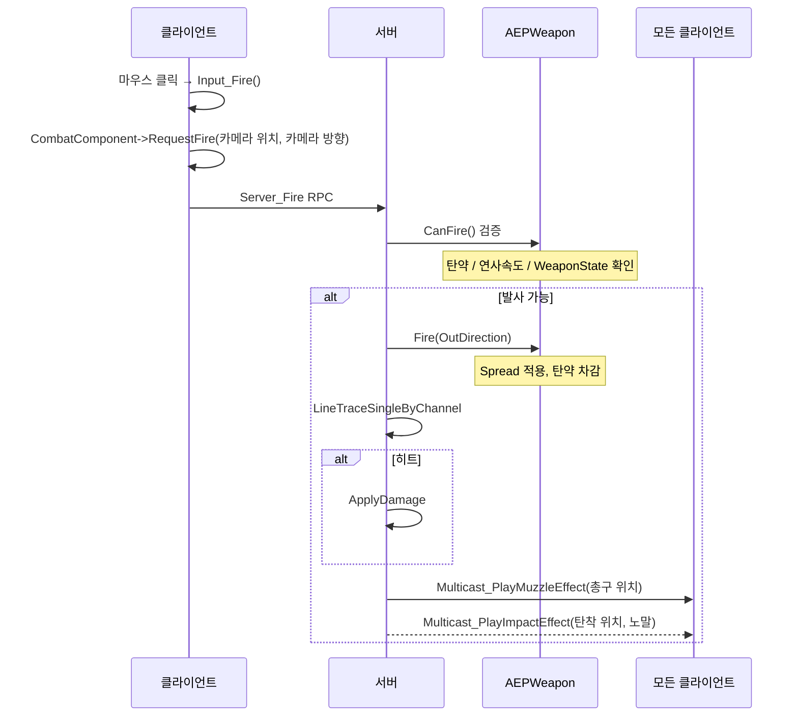

# Post 2-4 작성 가이드 — CombatComponent & 무기 시스템

> **예상 제목**: `[UE5] 추출 슈터 2-4. CombatComponent 분리와 무기 액터 설계`
> **참고 문서**: DOCS/Notes/02_CombatComponent_Refactor.md, DOCS/Notes/02_Implementation.md

---

## 개요

**이 포스팅에서 다루는 것:**
- 비대해진 ACharacter에서 전투 로직을 UEPCombatComponent로 분리하는 과정
- AEPWeapon 액터 설계 (월드 표현체 역할)
- 서버 권한 사격 흐름 전체

**왜 이렇게 구현했는가 (설계 의도):**
- Character SRP(단일 책임 원칙) 위반 해소: 이동/시점/전투가 한 클래스에 몰리면 유지보수 불가
- GAS 4단계 이관 전 경로 정리: CombatComponent를 진입점으로 단일화해두면 나중에 GA 교체만 하면 됨
- Weapon Actor는 "표현체"일 뿐, 상태 원본은 ItemInstance

---

## 구현 전 상태 (Before)

```cpp
// 기존: AEPCharacter가 전투까지 모두 담당
class AEPCharacter : public ACharacter
{
    AEPWeapon* EquippedWeapon;

    UFUNCTION(Server, Reliable)
    void Server_Fire(FVector Origin, FVector Direction);

    UFUNCTION(NetMulticast, Unreliable)
    void Multicast_PlayFireEffect(FVector MuzzleLocation);

    virtual float TakeDamage(...) override;
    // + 이동, 입력, HP, 사망 코드가 모두 여기에...
};
```

**문제점:**
- EPCharacter.cpp가 수천 줄 → 수정 시 충돌, 디버깅 어려움
- 발사/탄착 이펙트 좌표 버그가 Character 내부에서 반복 발생
- 향후 GAS 이관 시 전체 Character를 뒤져야 함

---

## 구현 내용

### 1. ACharacter 역할 분리 원칙

포스팅에서 표로 정리:

| 역할 | 담당 |
|------|------|
| 이동/시점/점프/Sprint/ADS | AEPCharacter 유지 |
| 입력 → 전투 위임 | `Input_Fire() → CombatComponent->HandleFire()` |
| 발사/재장전/RPC/이펙트 | **UEPCombatComponent**로 이동 |
| 장착 표현체 | AEPWeapon (월드 위치/메시/소켓) |
| 아이템 런타임 상태 | UEPWeaponInstance (탄약, 내구도) |

### 2. UEPCombatComponent 핵심 구조

```cpp
UCLASS(ClassGroup=(Custom), meta=(BlueprintSpawnableComponent))
class UEPCombatComponent : public UActorComponent
{
public:
    void EquipWeapon(AEPWeapon* NewWeapon);
    void UnequipWeapon();
    void RequestFire(const FVector& Origin, const FVector& Direction);  // Input_Fire에서 호출

    UPROPERTY(ReplicatedUsing = OnRep_EquippedWeapon, BlueprintReadOnly)
    TObjectPtr<AEPWeapon> EquippedWeapon;

protected:
    float LocalLastFireTime = 0.f;

    // VFX/SFX — 임시 배치 (향후 WeaponDefinition으로 이관 예정)
    UPROPERTY(EditDefaultsOnly, Category = "VFX|Fire") TObjectPtr<UNiagaraSystem> MuzzleFX;
    UPROPERTY(EditDefaultsOnly, Category = "VFX|Fire") TObjectPtr<UNiagaraSystem> ImpactFX;
    UPROPERTY(EditDefaultsOnly, Category = "SFX|Fire") TObjectPtr<USoundBase> FireSFX;
    UPROPERTY(EditDefaultsOnly, Category = "SFX|Fire") TObjectPtr<USoundBase> ImpactSFX;

    UFUNCTION(Server, Reliable)
    void Server_Fire(const FVector& Origin, const FVector& Direction);
    UFUNCTION(Server, Reliable)
    void Server_Reload();

    // 이펙트를 총구와 탄착으로 분리 (좌표가 다름)
    UFUNCTION(NetMulticast, Unreliable)
    void Multicast_PlayMuzzleEffect(const FVector_NetQuantize& MuzzleLocation);
    UFUNCTION(NetMulticast, Unreliable)
    void Multicast_PlayImpactEffect(const FVector_NetQuantize& ImpactPoint,
                                    const FVector_NetQuantize& ImpactNormal);
};
```

**VFX/SFX가 CombatComponent에 임시 배치된 이유:**
- 원칙상 MuzzleFX, ImpactFX는 `UEPWeaponDefinition`에 있어야 함
- 현재는 빠른 구현을 위해 Component에 직접 배치
- GAS 이관 시 Definition → Fragment → Gameplay Cue 경로로 교체 예정

### 3. 서버 권한 사격 흐름



**총구와 탄착을 별도 Multicast로 분리한 이유:**
```
총구 이펙트: WeaponMesh MuzzleSocket 위치 (항상 발생)
탄착 이펙트: Hit.ImpactPoint 위치 (히트 시에만, 노말 방향 필요)
→ 좌표와 발생 조건이 달라 하나로 합치면 불필요한 데이터 전송 발생
```

### 4. AEPWeapon 설계 — 게임 로직이 Actor에 있는 현재 구조

```cpp
UCLASS()
class AEPWeapon : public AActor
{
public:
    UPROPERTY(EditDefaultsOnly, BlueprintReadOnly)
    TObjectPtr<UEPWeaponDefinition> WeaponDef;   // 정적 스탯

    UPROPERTY(VisibleAnywhere, BlueprintReadOnly)
    TObjectPtr<USkeletalMeshComponent> WeaponMesh;

    // 런타임 상태 (복제)
    UPROPERTY(ReplicatedUsing = OnRep_CurrentAmmo)
    uint8 CurrentAmmo = 0;
    UPROPERTY(Replicated)
    uint8 MaxAmmo = 30;

    // 발사 인터페이스
    bool CanFire() const;       // 탄약/연사속도/WeaponState 검증
    void Fire(FVector& OutDirection);  // Spread 적용 후 방향 반환
    FVector ApplySpread(const FVector& Direction) const;

    void StartReload();
    void FinishReload();

protected:
    // 서버 런타임 상태 (복제 X — 서버만 알면 됨)
    EEPWeaponState WeaponState = EEPWeaponState::Idle;
    float LastFireTime = 0.f;
    float CurrentSpread = 0.f;    // 연사 시 누적 퍼짐
    uint8 ConsecutiveShots = 0;
};
```

**현재 AEPWeapon의 역할이 많다:**
- 시각 표현 (WeaponMesh, 소켓)
- 발사 가능 여부 판단 (CanFire)
- Spread 계산 및 적용 (ApplySpread)
- WeaponState 머신 (Idle/Firing/Reloading)
- 탄약 상태 복제 (CurrentAmmo)

→ "표현체"라고 했지만 실제로는 게임 로직도 상당수 담당. GAS 이관 시 로직은 Ability로, 상태는 Instance로 단계적으로 이동 예정.

### 5. 무기 장착 — WeaponSocket + LinkAnimClassLayers

```cpp
void UEPCombatComponent::EquipWeapon(AEPWeapon* NewWeapon)
{
    EquippedWeapon = NewWeapon;
    AEPCharacter* Owner = GetOwnerCharacter();

    // 손에 부착
    NewWeapon->AttachToComponent(Owner->GetMesh(),
        FAttachmentTransformRules::SnapToTargetNotIncludingScale,
        TEXT("WeaponSocket"));  // hand_r 본에 추가한 소켓

    // 무기별 애니메이션 레이어 교체
    if (NewWeapon->WeaponDef && NewWeapon->WeaponDef->WeaponAnimLayer)
        Owner->GetMesh()->LinkAnimClassLayers(NewWeapon->WeaponDef->WeaponAnimLayer);
}

// 클라이언트 OnRep에서도 동일하게
void UEPCombatComponent::OnRep_EquippedWeapon()
{
    // 서버에서 한 것과 동일하게 attach + LinkAnimClassLayers
}
```

> **스크린샷 위치**: 스켈레톤 에디터에서 hand_r 본에 WeaponSocket 추가하는 화면

### 6. 좌표 분리 원칙

포스팅에서 강조할 것:
```
트레이스 시작: 카메라 위치  (화면 중앙 = 플레이어가 보는 방향)
총구 이펙트:  WeaponMesh->MuzzleSocket  (실제 총구 위치)
탄착 이펙트:  Hit.ImpactPoint           (피탄 지점)
```

이 3가지를 혼동하면 이펙트가 엉뚱한 곳에 생성됨

---

## 결과

**확인 항목:**
- 사격 시 서버에서 레이캐스트, 2인 접속에서 HP 감소 확인
- 총구 이펙트가 WeaponMesh MuzzleSocket 위치에 생성
- 무기가 hand_r WeaponSocket에 부착되어 손에 들려보임
- OnRep_EquippedWeapon으로 클라이언트에도 무기 보임

**한계 및 향후 개선:**
- HandleFire → Server_Fire 사이에 Lag Compensation 삽입 예정 (3단계)

### CombatComponent의 구조적 한계 (포스팅에서 솔직하게 쓸 것)

현재 CombatComponent가 하는 일:

```
UEPCombatComponent
  ├── 장착 무기 관리    ← Equipment 역할
  ├── 발사 실행 (RPC)  ← Ability 역할
  └── 이펙트 재생      ← Effect 역할
→ 하나가 너무 많은 책임
```

**Lyra/실무 기준 이상적 구조:**

```
AEPCharacter
  ├── UEPInventoryComponent     "무엇을 갖고 있나"
  │     TArray<UEPItemInstance*>
  │
  ├── UEPEquipmentComponent     "무엇을 장착했나"  ← CombatComponent 대체
  │     PrimarySlot: UEPItemInstance*
  │     SecondarySlot: UEPItemInstance*
  │     GetActiveWeaponDef()
  │
  └── UAbilitySystemComponent (GAS)
        ├── GA_Fire     "어떻게 쏘나"  ← Server_Fire 대체
        ├── GA_Reload   "어떻게 재장전하나"
        └── GA_ADS      "어떻게 조준하나"
```

**발사 흐름 비교:**

```
[현재]
Input → CombatComponent->HandleFire() → Server_Fire RPC → LineTrace → ApplyDamage

[이상적 (GAS 이후)]
Input → GA_Fire 활성화
          → EquipmentComponent->GetActiveInstance() 조회
          → Instance->GetDefinition()->Damage
          → LineTrace (서버)
          → GameplayEffect_Damage 적용
          → GameplayEffect_ConsumeAmmo 적용
```

**현재 → 이상적 매핑:**

| 현재 | 이상적 | 역할 |
|------|--------|------|
| CombatComponent::EquippedWeapon | EquipmentComponent::PrimarySlot | 장착 상태 |
| CombatComponent::Server_Fire | GA_Fire (GAS Ability) | 발사 실행 |
| CombatComponent::Multicast_PlayFireEffect | GA_Fire 내부 Cue | 이펙트 |
| AEPWeapon::CurrentAmmo | UEPWeaponInstance::CurrentAmmo | 탄약 상태 |
| (없음) | InventoryComponent | 인벤토리 |

**단계별 전환 계획:**

```
Stage 2 (현재): CombatComponent 유지
  → 구조 이해 + 동작 확인이 목표

Stage 3 (Lag Compensation): HandleFire에 보정 삽입
  → CombatComponent 구조는 그대로

Stage 4 (GAS): GA_Fire, GA_Reload로 발사 이관
  → CombatComponent → EquipmentComponent로 리팩터링
  → 진입점은 같고 내부만 GA 호출로 교체

Stage 5+ (인벤토리): InventoryComponent 추가
  → 슬롯 시스템 완성, 루팅 가능
```

> 포스팅에서: "CombatComponent는 GAS 전환을 위한 과도기 구조다. 발사 진입점을 단일화해두면 나중에 내부를 GA 호출로 교체하는 것만으로 충분하다."

---

## 참고

- `DOCS/Notes/02_CombatComponent_Refactor.md` — 분리 전략 전체
- `DOCS/Notes/02_Implementation.md` Step 3~5
- `FVector_NetQuantize`, `FVector_NetQuantizeNormal` 문서
